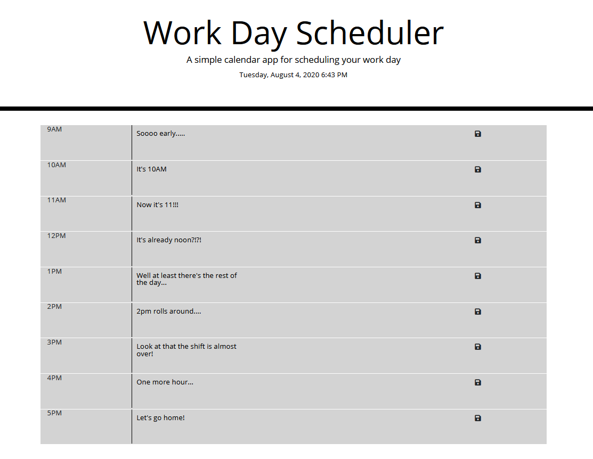

* Day Planner

<!-- Live link to deployed app -->
Repository: https://github.com/Mdudzik92/day-planner-app
Deployed app: mdudzik92.github.io/day-planner-app/

<!-- Technologies used -->
HTML, CSS, jQuery, JavaScript, Moment

<!-- Explanation of what the app is -->
This is a simple calendar app which allows the user to save events for each hour of the day. This app runs in the browser and features dynamically updated HTML and CSS powered by jQuery.

<!-- Screenshot -->

<!-- License -->
MIT

<!-- Contact information -->
Email: mdudzik92@gmail.com